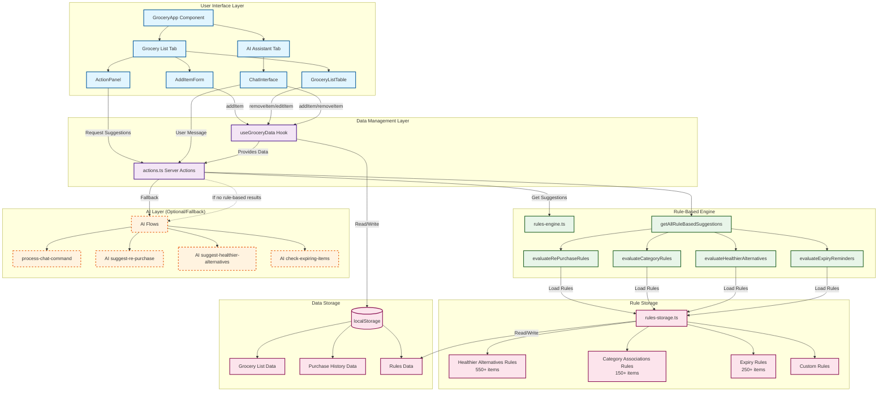
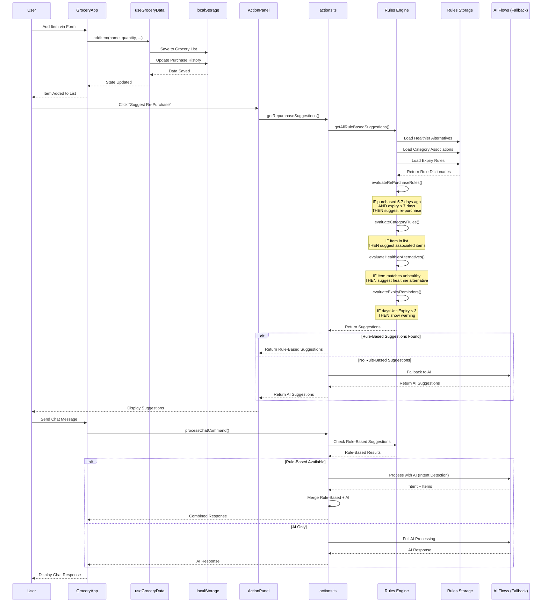
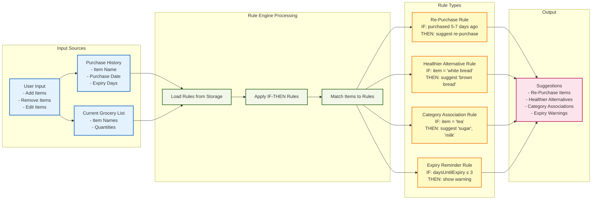
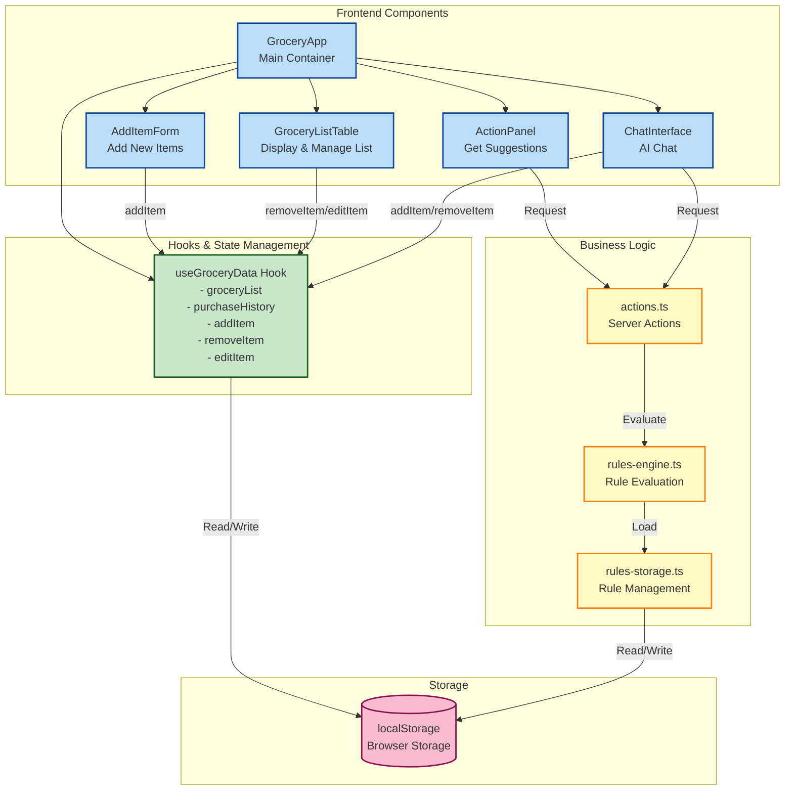

# Smart Grocery Shopping Assistant - Application Flow Diagram

## Complete System Architecture



## Detailed Process Flow



## Rule-Based Decision Flow

```mermaid
flowchart TD
    Start([User Requests Suggestion]) --> LoadData[Load Purchase History<br/>& Current Grocery List]
    
    LoadData --> CheckRePurchase{Re-Purchase<br/>Request?}
    LoadData --> CheckHealthier{Healthier<br/>Alternatives?}
    LoadData --> CheckExpiry{Expiry<br/>Reminders?}
    LoadData --> CheckCategory{Category<br/>Associations?}
    
    %% Re-Purchase Rules
    CheckRePurchase -->|Yes| Rule1[Rule 1: Check Purchase Date]
    Rule1 -->|IF purchased 5-7 days ago| Rule1a[AND expiry ≤ 7 days]
    Rule1a -->|THEN| Suggest1[Suggest Re-Purchase]
    
    Rule1 -->|ELSE| Rule2[Rule 2: Check Purchase Frequency]
    Rule2 -->|IF purchased ≥3 times| Rule2a[AND within 14 days]
    Rule2a -->|THEN| Suggest1
    
    %% Healthier Alternatives Rules
    CheckHealthier -->|Yes| Rule3[Load Healthier Alternatives Map<br/>550+ rules]
    Rule3 --> Rule3a{Item matches<br/>unhealthy item?}
    Rule3a -->|Yes| Rule3b[Find healthier alternative]
    Rule3b -->|IF alternative not in list| Suggest2[Suggest Healthier Alternative]
    Rule3a -->|No| NoHealthier[No Healthier Alternative]
    
    %% Category Associations Rules
    CheckCategory -->|Yes| Rule4[Load Category Associations Map<br/>150+ rules]
    Rule4 --> Rule4a{Item has<br/>associations?}
    Rule4a -->|Yes| Rule4b[Check associated items]
    Rule4b -->|IF not in current list| Suggest3[Suggest Associated Items]
    Rule4a -->|No| NoCategory[No Category Suggestions]
    
    %% Expiry Rules
    CheckExpiry -->|Yes| Rule5[Load Expiry Rules Map<br/>250+ rules]
    Rule5 --> Rule5a[Calculate Days Until Expiry]
    Rule5a --> Rule5b{daysUntilExpiry ≤ 0?}
    Rule5b -->|Yes| Critical[CRITICAL: Item Expired]
    Rule5b -->|No| Rule5c{daysUntilExpiry ≤ 3?}
    Rule5c -->|Yes| Warning[WARNING: Expiring Soon]
    Rule5c -->|No| NoExpiry[No Expiry Issues]
    
    %% Combine Results
    Suggest1 --> Combine[Combine All Suggestions]
    Suggest2 --> Combine
    Suggest3 --> Combine
    Critical --> Combine
    Warning --> Combine
    NoHealthier --> Combine
    NoCategory --> Combine
    NoExpiry --> Combine
    
    Combine --> CheckResults{Any<br/>Suggestions?}
    CheckResults -->|Yes| ReturnRules[Return Rule-Based Suggestions]
    CheckResults -->|No| FallbackAI[Fallback to AI<br/>(if enabled)]
    
    ReturnRules --> End([Display Suggestions to User])
    FallbackAI --> End
    
    %% Styling
    classDef ruleBox fill:#e8f5e9,stroke:#1b5e20,stroke-width:2px
    classDef decision fill:#fff3e0,stroke:#e65100,stroke-width:2px
    classDef suggestion fill:#e1f5ff,stroke:#01579b,stroke-width:2px
    classDef endPoint fill:#f3e5f5,stroke:#4a148c,stroke-width:3px
    
    class Rule1,Rule1a,Rule2,Rule2a,Rule3,Rule3a,Rule3b,Rule4,Rule4a,Rule4b,Rule5,Rule5a,Rule5b,Rule5c ruleBox
    class CheckRePurchase,CheckHealthier,CheckExpiry,CheckCategory,Rule3a,Rule4a,Rule5b,Rule5c,CheckResults decision
    class Suggest1,Suggest2,Suggest3,Critical,Warning suggestion
    class Start,End endPoint
```

## Data Flow Diagram



## Component Interaction Diagram



