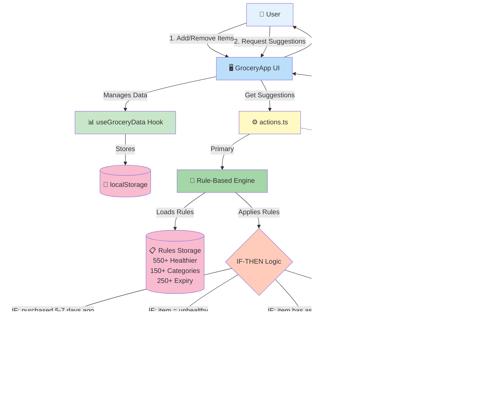
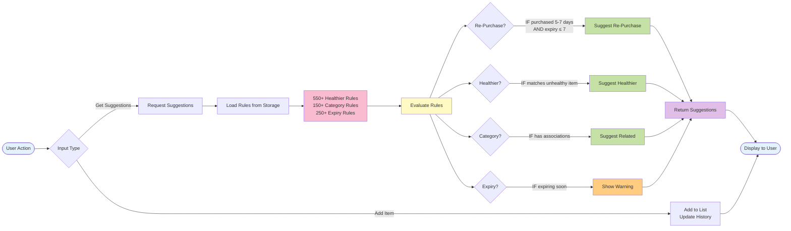
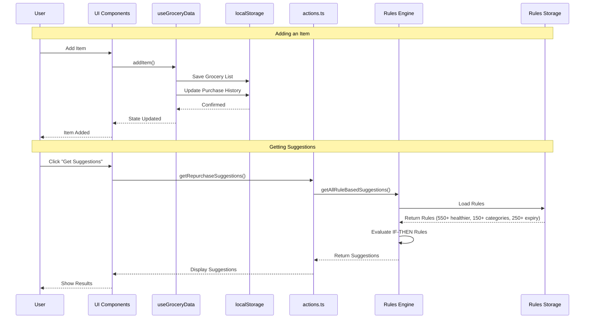

# Quick Flow Diagram - Smart Grocery Shopping Assistant

## Simplified Application Flow

```mermaid
graph TD
    User[👤 User] -->|1. Add/Remove Items| UI[🖥️ GroceryApp UI]
    User -->|2. Request Suggestions| UI
    
    UI -->|Manages Data| Hook[📊 useGroceryData Hook]
    Hook -->|Stores| Storage[(💾 localStorage)]
    
    UI -->|Get Suggestions| Actions[⚙️ actions.ts]
    Actions -->|Primary| Engine[🧠 Rule-Based Engine]
    Actions -.->|Fallback| AI[🤖 AI Flows]
    
    Engine -->|Loads Rules| Rules[(📋 Rules Storage<br/>550+ Healthier<br/>150+ Categories<br/>250+ Expiry)]
    
    Engine -->|Applies Rules| Process{IF-THEN Logic}
    Process -->|IF: purchased 5-7 days ago| RePurchase[✅ Suggest Re-Purchase]
    Process -->|IF: item = unhealthy| Healthier[✅ Suggest Healthier Alternative]
    Process -->|IF: item has associations| Category[✅ Suggest Related Items]
    Process -->|IF: daysUntilExpiry ≤ 3| Expiry[⚠️ Show Warning]
    
    RePurchase --> Results[📝 Suggestions]
    Healthier --> Results
    Category --> Results
    Expiry --> Results
    
    Results -->|Display| UI
    UI -->|Shows| User
    
    style User fill:#e3f2fd
    style UI fill:#bbdefb
    style Hook fill:#c8e6c9
    style Storage fill:#f8bbd0
    style Actions fill:#fff9c4
    style Engine fill:#a5d6a7
    style Rules fill:#f8bbd0
    style Process fill:#ffccbc
    style RePurchase fill:#c5e1a5
    style Healthier fill:#c5e1a5
    style Category fill:#c5e1a5
    style Expiry fill:#ffcc80
    style Results fill:#e1bee7
    style AI fill:#ffe0b2,stroke-dasharray: 5 5
```

## Rule-Based Engine Process

```mermaid
flowchart LR
    Start([User Action]) --> Input{Input Type}
    
    Input -->|Add Item| Add[Add to List<br/>Update History]
    Input -->|Get Suggestions| Suggest[Request Suggestions]
    
    Suggest --> Load[Load Rules from Storage]
    Load --> Rules[550+ Healthier Rules<br/>150+ Category Rules<br/>250+ Expiry Rules]
    
    Rules --> Eval[Evaluate Rules]
    
    Eval --> R1{Re-Purchase?}
    Eval --> R2{Healthier?}
    Eval --> R3{Category?}
    Eval --> R4{Expiry?}
    
    R1 -->|IF purchased 5-7 days<br/>AND expiry ≤ 7| S1[Suggest Re-Purchase]
    R2 -->|IF matches unhealthy item| S2[Suggest Healthier]
    R3 -->|IF has associations| S3[Suggest Related]
    R4 -->|IF expiring soon| S4[Show Warning]
    
    S1 --> Output[Return Suggestions]
    S2 --> Output
    S3 --> Output
    S4 --> Output
    
    Output --> Display([Display to User])
    Add --> Display
    
    style Start fill:#e3f2fd
    style Rules fill:#f8bbd0
    style Eval fill:#fff9c4
    style S1 fill:#c5e1a5
    style S2 fill:#c5e1a5
    style S3 fill:#c5e1a5
    style S4 fill:#ffcc80
    style Output fill:#e1bee7
    style Display fill:#e3f2fd
```

## Data Flow

```mermaid
sequenceDiagram
    participant U as User
    participant UI as UI Components
    participant H as useGroceryData
    participant S as localStorage
    participant A as actions.ts
    participant E as Rules Engine
    participant R as Rules Storage

    Note over U,R: Adding an Item
    U->>UI: Add Item
    UI->>H: addItem()
    H->>S: Save Grocery List
    H->>S: Update Purchase History
    S-->>H: Confirmed
    H-->>UI: State Updated
    UI-->>U: Item Added

    Note over U,R: Getting Suggestions
    U->>UI: Click "Get Suggestions"
    UI->>A: getRepurchaseSuggestions()
    A->>E: getAllRuleBasedSuggestions()
    E->>R: Load Rules
    R-->>E: Return Rules (550+ healthier, 150+ categories, 250+ expiry)
    E->>E: Evaluate IF-THEN Rules
    E-->>A: Return Suggestions
    A-->>UI: Display Suggestions
    UI-->>U: Show Results
```

